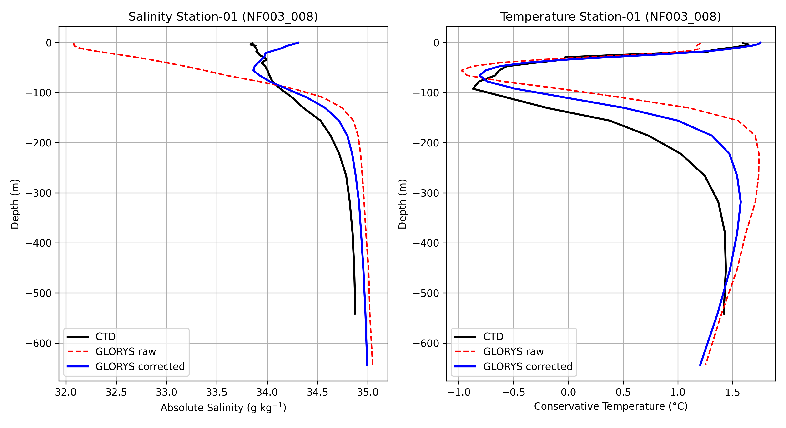
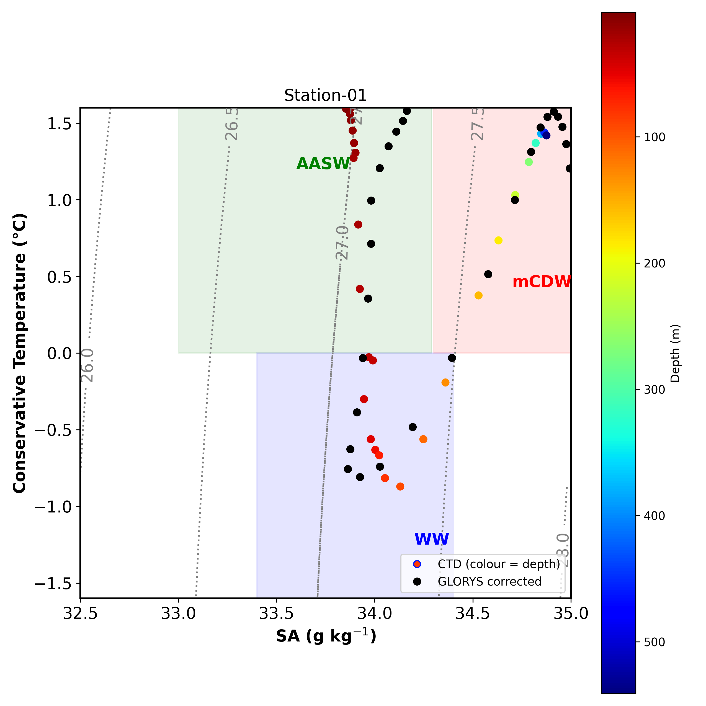

# glorys-antarctic-correction

<!-- TODO after the first release: add the Zenodo DOI badge here. -->

Adaptive thermodynamic correction of GLORYS12V1 ocean reanalysis temperature
and salinity profiles against CTD observations, applied in Marguerite Bay,
western Antarctic Peninsula. The algorithm is provided in **MATLAB** and in
**Python**; both implementations produce the same results.

This repository accompanies the article:

> Morales-Acuña, E., Linero-Cueto, J., Manrique-Cantillo, A.,
> Gutiérrez-Cardenas, G., Escobedo-Urías, D., Olarte-García, C., and
> Dikul, N.: An adaptive thermodynamic correction framework for GLORYS ocean
> reanalysis in a coastal Antarctic fjord, TODO journal, TODO, 2026.

## Why a correction is needed

Global ocean reanalyses such as Copernicus Marine's GLORYS12V1 (1/12°) provide
continuous temperature and salinity fields, but coastal polar systems strain
them: narrow fjords are poorly resolved, glacial and sea-ice meltwater are
not represented locally, and numerical mixing smooths the vertical structure.
In Marguerite Bay, compared with CTD casts from December 2025, the raw
GLORYS12V1 profiles

- **underestimate near-surface salinity** (mean bias −0.39 to −0.80 g kg⁻¹),
  with a surface layer that is too fresh and too stratified; and
- **erode Winter Water**, the cold subsurface layer between Antarctic Surface
  Water and the warm modified Circumpolar Deep Water below, so that subsurface
  temperatures are too warm (mean bias up to 1.18 °C).

A uniform bias correction cannot fix both problems without damaging the deep
water masses, because the errors depend on depth and on the local
stratification.

## What the algorithm does

At each CTD station the algorithm corrects the GLORYS profile on the GLORYS
vertical levels, with weights that depend on the local physics:

1. **Bias term** — removes the smoothed model-minus-CTD bias with a weight
   `0.92 exp(−z / 80 m) + 0.35`: strong near the surface, where the model
   errs most, and weak at depth, which preserves modified Circumpolar Deep
   Water.
2. **Structural term** — relaxes the model's vertical gradients towards the
   observed ones over a length of 4 m (temperature) and 2 m (salinity),
   weighted by the normalised stratification N²/max(N²). It acts where the
   water column is stratified and restores the thermocline, halocline and
   Winter Water core.
3. **Diffusive-convection adjustment** — removes a further 8 % of the bias
   where the Turner angle lies between −90° and −45°, the double-diffusive
   regime of cold, fresh water above warm, salty water.

The CTD casts are quality controlled, binned to 1 m with the median and
smoothed. All thermodynamics use TEOS-10 (Gibbs SeaWater): temperatures are
Conservative Temperature Θ and salinities Absolute Salinity, the variables
that are conserved when water masses mix. The full
specification, including the numerical definitions that make the two
implementations agree, is in [`docs/method.md`](docs/method.md).

**Uses.** The corrected profiles give a GLORYS-consistent, observation-adjusted
description of the water column at the stations — for example to assess
reanalysis skill in fjords, to set regional model boundary conditions or to
study water-mass structure. The correction needs a CTD cast at the station;
it does not extrapolate corrections away from the casts. Its parameters were
set for six stations in one fjord system in one season. Corrected values are
supported by data only where both the GLORYS profile and the CTD cast exist;
see "Known limitations" in [`data/DATASET_README.md`](data/DATASET_README.md).

## Implementations

The two implementations follow the same steps, use the same function names
and write the same outputs.

| | MATLAB | Python |
|---|---|---|
| Folder | [`matlab/`](matlab/) | [`python/`](python/) |
| Requirements | MATLAB R2019b or later; [GSW Oceanographic Toolbox](https://www.teos-10.org/software.htm) | Python ≥ 3.10; numpy, scipy, pandas, matplotlib, gsw |
| Run the six stations | `run_correction` | `python -m glorys_correction` |
| Tests | `run tests/run_tests.m` | `pytest` |
| Default output folder | `outputs/matlab/` | `outputs/python/` |

Quick start in MATLAB (GSW Toolbox on the path):

```matlab
cd matlab
run_correction            % metrics, profiles and summary
run_correction([], true)  % also figures
```

Quick start in Python ([Miniforge](https://github.com/conda-forge/miniforge),
from the repository root):

```bash
conda env create -f python/environment.yml
conda activate glorys-correction
pip install -e python
python -m glorys_correction --figures
```

To confirm that two runs agree:

```bash
python scripts/compare_implementations.py outputs/matlab outputs/python
```

For this release the two implementations write identical profiles; the
metrics differ by less than 10⁻¹³, the effect of floating-point summation
order.

Details: [`matlab/README.md`](matlab/README.md), [`python/README.md`](python/README.md).

## Results

The correction was applied to six CTD casts (S1–S6) taken on 11–15 December
2025 during cruise NF003 of RV *Noosfera*. Metrics compare GLORYS with the CTD
on the GLORYS levels where both have data, the same levels before and after
correction (model minus CTD; before → after). Table 2 of the article reports
these values rounded to two decimals.

**Conservative Temperature (°C)**

| Station | Bias | RMSE | r |
|---|---|---|---|
| S1 | 0.077 → 0.165 | 0.526 → 0.277 | 0.822 → 0.968 |
| S2 | 1.061 → 0.171 | 1.206 → 0.546 | 0.769 → 0.832 |
| S3 | 0.471 → 0.053 | 0.716 → 0.339 | 0.780 → 0.893 |
| S4 | 0.687 → −0.053 | 0.982 → 0.345 | 0.730 → 0.929 |
| S5 | 0.789 → −0.022 | 1.299 → 0.552 | 0.426 → 0.668 |
| S6 | 1.179 → 0.007 | 1.447 → 0.450 | 0.635 → 0.814 |

**Absolute Salinity (g kg⁻¹)**

| Station | Bias | RMSE | r |
|---|---|---|---|
| S1 | −0.803 → 0.141 | 1.175 → 0.210 | 0.921 → 0.911 |
| S2 | −0.448 → 0.161 | 0.845 → 0.223 | 0.881 → 0.944 |
| S3 | −0.757 → 0.163 | 1.112 → 0.246 | 0.843 → 0.838 |
| S4 | −0.667 → 0.112 | 1.000 → 0.182 | 0.965 → 0.961 |
| S5 | −0.393 → 0.140 | 0.769 → 0.204 | 0.905 → 0.958 |
| S6 | −0.456 → 0.115 | 0.746 → 0.177 | 0.935 → 0.962 |

- Salinity RMSE falls by 74–82 % at every station (from 0.75–1.17 to
  0.18–0.25 g kg⁻¹), removing the fresh near-surface bias. The salinity
  correlation changes little: it rises at S2, S5 and S6 and falls slightly
  at S1, S3 and S4.
- Temperature RMSE falls by 47–69 % (from 0.53–1.45 to 0.28–0.55 °C), and the
  correlation with the observed profile rises at every station.
- At S1 the mean temperature bias grows (0.08 → 0.16 °C) while the RMSE halves
  and the correlation reaches 0.97: positive and negative errors of the raw
  profile cancelled in the mean.
- S5 keeps the lowest temperature correlation (0.67) after correction. Its
  sharp temperature minimum near 100 m is finer than the GLORYS levels
  resolve, and below 400 m the raw GLORYS profile lacks the warm mCDW
  (−0.80 °C at 454 m, where the CTD measures 1.22 °C); at depth the bias
  term removes only 35 % of the bias, so the corrected profile remains too
  cold there (−0.08 °C).

| Vertical profiles, S1 | T–S diagram, S1 |
|---|---|
|  |  |

All figures, the per-station corrected profiles and the metrics are in
[`results/`](results/). Figures 2 and 3 of the article
(`results/figures/article_fig2_profiles.png`, `article_fig3_ts.png`) are
drawn from the corrected profiles with:

```bash
python scripts/make_article_figures.py
```

## Outputs

Each run writes:

| File | Content |
|---|---|
| `metrics.csv` | Bias, RMSE and Pearson r, before and after correction, per station |
| `summary.txt` | The same metrics as printed to the console |
| `profiles/NF003_0XX_corrected_profile.csv` | CTD, raw GLORYS and corrected GLORYS on the GLORYS levels, with N², Turner angle and weights |
| `figures/profiles_Station-0X.png`, `figures/TS_Station-0X.png` | Vertical profiles and T–S diagrams (optional) |

Columns and formats: [`docs/outputs.md`](docs/outputs.md).

## Data

[`data/raw/`](data/raw/) contains the inputs: six Sea-Bird CTD casts and the
GLORYS12V1 profiles at each station. The citable copy of the data, together
with the corrected profiles, is archived on Zenodo (https://doi.org/10.5281/zenodo.23112579); see
[`data/DATASET_README.md`](data/DATASET_README.md) for variables, units,
provenance and licences.

The GLORYS station profiles are the daily mean of the day nearest to each
cast, summarised (mean, median, standard deviation) over the 2 × 2 grid cells
nearest to the station. They can be regenerated from a regional GLORYS12V1
file (daily `thetao` and `so`, not distributed here):

```bash
pip install -e "python[extract]"
python scripts/extract_glorys.py path/to/GLORYS.nc --compare
```

## Repository structure

```
matlab/      MATLAB implementation and its tests
python/      Python implementation (package glorys_correction) and its tests
data/        input data, station metadata, checksums, dataset description
results/     metrics, corrected profiles and figures of the article
docs/        method specification and output formats
scripts/     extract_glorys.py, compare_implementations.py, build_data_package.py,
             make_article_figures.py
```

## How to cite

Please cite the article, and the software version and dataset you used:

- Software: Morales-Acuña, E., Gutiérrez-Cardenas, G. and Manrique-Cantillo, A.:
  glorys-antarctic-correction (v1.0.0), Zenodo, TODO software DOI.
- Data: Morales-Acuña, E., Linero-Cueto, J., Manrique-Cantillo, A.,
  Gutiérrez-Cardenas, G., Escobedo-Urías, D., Olarte-García, C. and Dikul, N.:
  CTD casts and corrected GLORYS12V1 temperature and salinity profiles,
  Marguerite Bay, Antarctic Peninsula, December 2025 (v1.0.0), Zenodo,
  https://doi.org/10.5281/zenodo.23112579.

GitHub's *Cite this repository* button uses [`CITATION.cff`](CITATION.cff).

## Licence

- **Code** (`matlab/`, `python/`, `scripts/`): MIT licence, see
  [`LICENSE`](LICENSE).
- **Data**: the CTD casts, the station metadata and the corrected profiles
  are licensed under [CC BY 4.0](https://creativecommons.org/licenses/by/4.0/).
  The corrected profiles are generated using E.U. Copernicus Marine Service
  Information (https://doi.org/10.48670/moi-00021).
- **GLORYS12V1 station profiles** (`data/raw/glorys/`): E.U. Copernicus
  Marine Service Information (https://doi.org/10.48670/moi-00021),
  redistributed under the Copernicus Marine Service licence.

Details: [`data/DATASET_README.md`](data/DATASET_README.md).

## Acknowledgements

This study has been conducted using E.U. Copernicus Marine Service
Information; https://doi.org/10.48670/moi-00021. CTD data were collected
during the 30th Ukrainian Antarctic Expedition (National Antarctic Scientific
Center of Ukraine).

This work was funded by the Programa Antártico Colombiano (Comisión
Colombiana del Océano, Colombia), the Instituto Politécnico Nacional
(Mexico) and the State Institution National Antarctic Scientific Center of
the Ministry of Education and Science of Ukraine (Kyiv, Ukraine).

## References

- IOC, SCOR and IAPSO (2010). The international thermodynamic equation of
  seawater – 2010 (TEOS-10). Intergovernmental Oceanographic Commission,
  Manuals and Guides No. 56.
- Lellouche, J.-M., et al. (2021). The Copernicus Global 1/12° Oceanic and Sea
  Ice GLORYS12 Reanalysis. *Frontiers in Earth Science*, 9, 698876.
  https://doi.org/10.3389/feart.2021.698876
- McDougall, T. J. and Barker, P. M. (2011). Getting started with TEOS-10 and
  the Gibbs Seawater (GSW) Oceanographic Toolbox. SCOR/IAPSO WG127.
